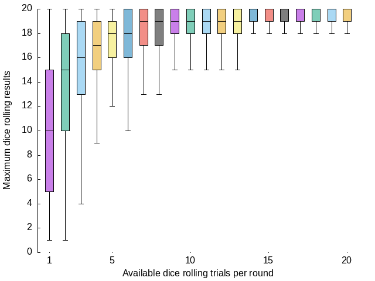

# Taking-advantage-of-dices
Evaluation on behaviors with the peak value of rolling multiple dices.

## Place your bets on rolling dices
DnD(Dungeons & Dragons)-like CRPG heavily rely on rolling dice, applying them to almost every in-game action. Simple as it may seem, probability distribution for rolling a single dice should be Math 101 for everyone. However, there is an interesting term called "granting advantage", which simply means rolling two dices and pick the high value as the result.

Yes, we can easily expect that rolling dice with 2 trials definitely performs better than with only 1 trials. But the question would be: how much?

| # of Retrial | Maximum Result (Average in 10000 Rounds) |
|:-:|:-:|
| 1 | 10.42 |
| 2 | 13.77 |
| 3 | 15.49 |
| 4 | 16.49 |
| 5 | 17.13 |
| 6 | 17.63 |
| 7 | 17.98 |
| 8 | 18.24 |
| 9 | 18.46 |
| 10 | 18.64 |
| 11 | 18.78 |
| 12 | 18.91 |
| 13 | 19.01 |
| 14 | 19.11 |
| 15 | 19.18 |
| 16 | 19.26 |
| 17 | 19.33 |
| 18 | 19.39 |
| 19 | 19.43 |
| 20 | 19.47 |

We roll a D20, where a D20 is a common terms for CRPG denoting "a 20-sided dice", 10000 times to first observe its behavior (with implementation code in the `/eval` directory). First as a sanity check, the expected value for rolling a D20 would be 10.5 (values ranging from 1 to 20), matching with our experiment result 10.42. Then we scale up the available # of trials within a round of dice rolling. As we can see here, the expected value grows in a manner of "concave function", finally approximating to 20, which is pretty reasonable after numerous of trials.

But how? Can we analyze the behavior from a systematic point of view, like in math?

## Order Statistics

! currently ignored due to lack of time for throughout comprehension

! pls fill in after wrapping the whole paragraph

## Card Shark for optimizing dice rolling 

Why do we even has to optimize the process of dice rolling? What's the big deal on constantly rolling dices? For DnD players, simplification can provide them with a more direct insight on what `advantage` can provide them with. More practically, to implement such mechanism on e-platforms, we rely on RNG(Random Number Generator) to stimulate the process of dice rolling.
However, entropy is a scarce resource to generate randon number, which means extreme usage of RNG can depletes the entropy sources. For those interested in the details of implementation of Linux RNG, please refer to [another article](https://chenishi.github.io/2020/12/06/practical-crypto-in-kernel/).

- Graph for expectation scales with the available re-rolling times.
- Numerical distribution difference wi/o "granting advantage".
  - Can we stimulate the process of rolling multiple dice to a numerical shift to the original case (to reduce entropy cost)?